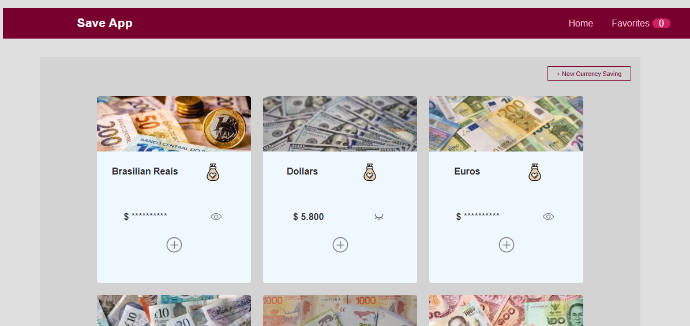
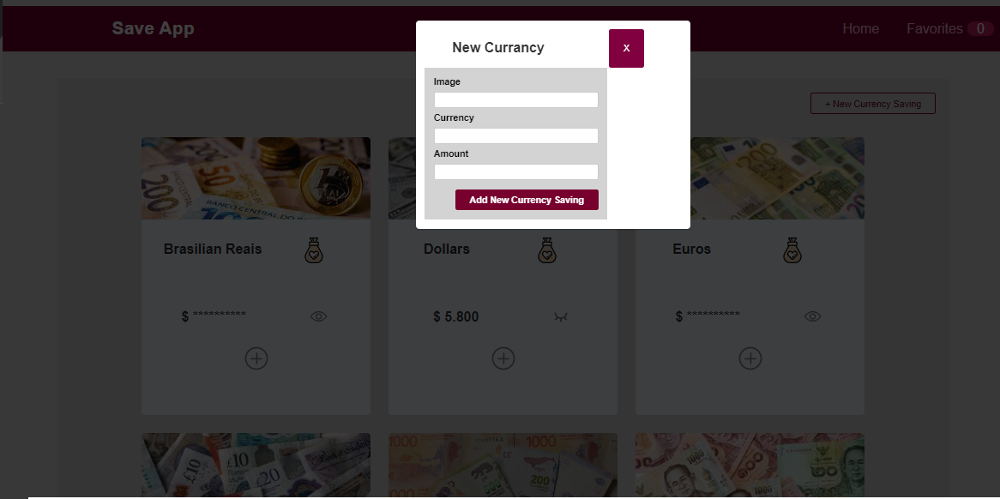
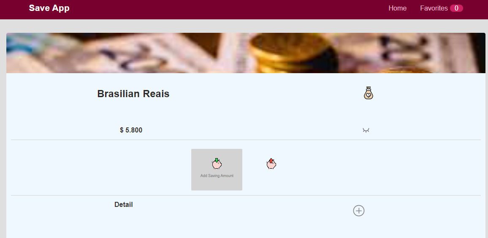
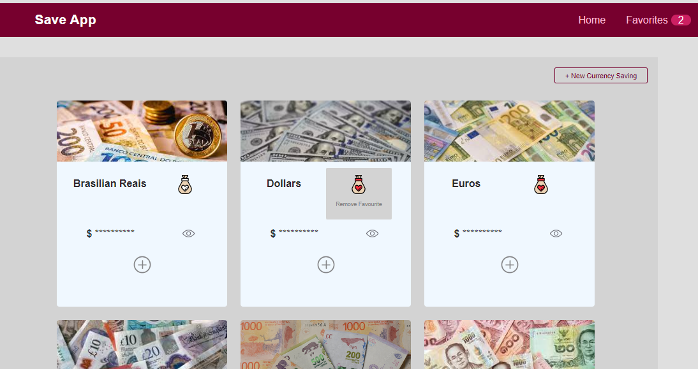

# Savings App

An app to keep track of personal savings. The aim is to consolidate all the savings that the user could have in different currencies and be able to know the total amount of money in an specific currency. 

Additionally a saving can have different shapes, e.g. euros on different bank accounts, physical tenance, etc. 

### Screenshots

#### Home

Shows a grid with all the savings.

#### Adding a new currency

Allows to add a new currency.

#### Adding a new saving

Allows to add a new saving in a specific currency.

#### Adding to favourites

By clicking the `add to Favourites`, adds a saving to the favourites list. 

### Future work

- Google login
- Currency reports
- Currency converter