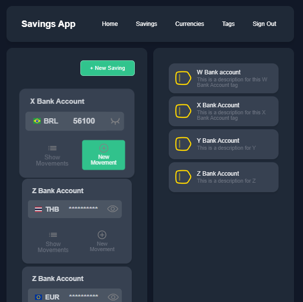
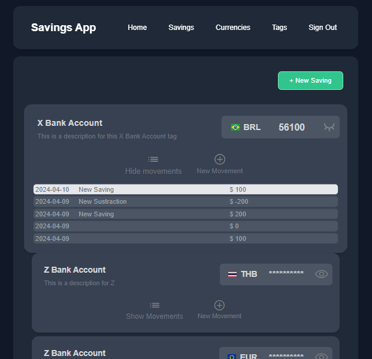

# Savings App

An app to keep track of personal savings. The aim is to consolidate all the savings that the user could have in different currencies and be able to know the total amount of money in an specific currency. 

Additionally a saving can have different shapes, e.g. euros on different bank accounts, physical tenance, etc. 

## Screenshots

### Sign In with Google

Provides access to app features by registering or login in with a Google Account.

### Home

Shows a grid with all the personal savings, allowing to filter by tag and currency.

### Currencies Page

Shows a list of available currencies

### Savings Page

Shows a list of current savings

#### Adding a new saving

Allows to add a new saving in a specific currency and tag.

#### Adding a new movement

Allows to make a new addition or sustraction movement to a saving.

#### Showing a saving movements list

Allows to see a detailed list of movements with pagination

##### Scenario 1: A saving has movements

##### Scenario 2: A saving has no related movements

##### Scenario 3: Internal error handler

### Tags Page

Shows a list of current tags

#### Adding a new tag

Allows to add a new tag.

Showing required fields error

#### Editing a tag name and/or description

#### Removing a tag

### Current work
- Google login

### Future work
- Filtering
- Currency converter
- Currency reports