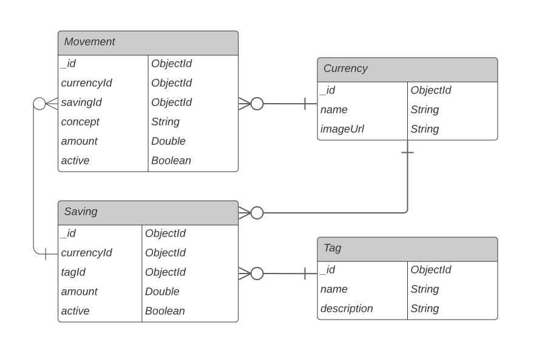

### Savings App

compile: tsc

run: node dist/app.js

### ERD

### Business Rules

- Saving amount is always updated -everytime a new movement is registered-.

- Movements save currency and saving: a movement currency always reflect the currency in which the registered movement has been done, while a saving currency reflects the current currency of its amount, which may change.   
